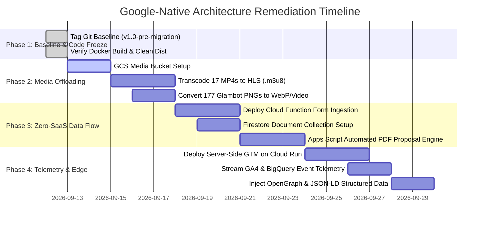

# Master Audit Summary & Remediation Roadmap

**Project:** The Lenscape Company Ltd. & Event Labs Guyana  
**Audit Standard:** Google-Native / Zero-SaaS Cloud Architecture Baseline  
**Document Code:** `AUDIT-MASTER-00`  
**Status:** Complete Baseline Extraction  

---

## 1. Executive Summary & Audit Suite Index

Following the comprehensive audit protocol defined in [gap_analysis_current_website_vs_targeted_architecture.md](file:///c:/Users/mike1/Documents/Antigravity/lenscape/agency-website/Docs/gap_analysis_current_website_vs_targeted_architecture.md), the existing codebase has been audited across all 9 baseline checklist criteria.

The complete audit findings are documented across three specialized volumes:

1. [01_technical_and_architecture_audit.md](file:///c:/Users/mike1/Documents/Antigravity/lenscape/agency-website/Docs/01_technical_and_architecture_audit.md)  
   *Covers:* Source repository mapping, runtime build pipeline (Vite 7.3.1), complete media footprint (906 assets, 578.10 MB), video inventory (17 active + 8 archived MP4s), hero canvas 177-frame bottleneck (127.26 MB), Docker multi-stage container configuration, and Caribbean edge network delivery.

2. [02_information_architecture_and_ux_audit.md](file:///c:/Users/mike1/Documents/Antigravity/lenscape/agency-website/Docs/02_information_architecture_and_ux_audit.md)  
   *Covers:* 8-route dual-market sitemap (Trinidad & Tobago parent and Guyana subsidiary), in-page anchors, modal triggers, Bento Grid 5-card interaction architecture, Flow A/B/C conversion paths, 2-step booking modal wizard, and centralized brand copy deck with client rosters (Burger King, Shell, VISA, Coca-Cola).

3. [03_data_flow_telemetry_and_seo_audit.md](file:///c:/Users/mike1/Documents/Antigravity/lenscape/agency-website/Docs/03_data_flow_telemetry_and_seo_audit.md)  
   *Covers:* Field-level schema audit across 4 website forms, identification of disconnected forms (`project-scoper-form` mock submit, `contact-form` stub mode), audit of telemetry tags (0 tracking tags installed), and technical SEO audit (missing canonicals, OpenGraph tags, and Schema.org JSON-LD).

---

## 2. Baseline Scorecard Across 9 Checklist Items

| Checklist Category | Baseline Extraction Item | Current Status | Primary Baseline Finding | Reference Document |
| :--- | :--- | :---: | :--- | :--- |
| **A. Technical & Architecture** | 1. Source Repository Audit | Verified | Multi-page Vite 7.3.1 app; 8 HTML entry points; clean ES module structure. | `AUDIT-TECH-01` |
| **A. Technical & Architecture** | 2. Media & Asset Inventory | Verified | 906 assets, 578.10 MB. 17 raw MP4s (126.38 MB) + 177 hero PNGs (127.26 MB). | `AUDIT-TECH-01` |
| **A. Technical & Architecture** | 3. Hosting & Network Config | Verified | Docker multi-stage build listening on port 8080; targeted for Google Cloud Run. | `AUDIT-TECH-01` |
| **B. IA & UX Components** | 4. Sitemap & Subpath Registry | Verified | Dual regional routing: `/` (Trinidad & Tobago) and `/eventlabs/` (Guyana). | `AUDIT-IAUX-02` |
| **B. IA & UX Components** | 5. Interactive Components | Verified | Bento Grid (Cards 1-5), Flow A Showreel, Flow B Filter, Flow C Drawer, Booking Wizard. | `AUDIT-IAUX-02` |
| **B. IA & UX Components** | 6. Content & Copy Deck | Verified | Full copy deck extracted; client roster validated across enterprise brands. | `AUDIT-IAUX-02` |
| **C. Data Flow & Telemetry** | 7. Form & Endpoint Inventory | Verified | 4 forms audited; 2 in stub/mock state; booking form uses direct Apps Script POST. | `AUDIT-DATA-03` |
| **C. Data Flow & Telemetry** | 8. Analytics & Tag Audit | Verified | Attribution black hole: 0 tracking scripts, 0 GTM containers, 0 pixels installed. | `AUDIT-DATA-03` |
| **C. Data Flow & Telemetry** | 9. SEO & Metadata Map | Verified | Titles & descriptions present; missing canonicals, OpenGraph, and JSON-LD. | `AUDIT-DATA-03` |

---

## 3. Master Remediation Classification Matrix

Every element audited has been assigned one of the three remediation flags defined in Section 4 of the gap analysis:

```
+-----------------------------------------------------------------------------------------+
| MASTER REMEDIATION MATRIX                                                               |
+------------------+--------------------------------------------------+-------------------+
| Taxonomy Flag    | Codebase Element                                 | Target Action     |
+------------------+--------------------------------------------------+-------------------+
| [KEEP]           | - Bento Grid Visuals & Cyberpunk Styling         | Maintain aesthetic|
|                  | - Lenis Smooth Scroll & GSAP ScrollTrigger       | Keep animation    |
|                  | - WebP Thumbnails Pipeline (public/thumbnails/)  | Retain outputs    |
|                  | - Multi-Page Subpath Structure (/eventlabs/)     | Preserve routing  |
|                  | - Mobile Cyberpunk Navigation Drawer             | Preserve layout   |
+------------------+--------------------------------------------------+-------------------+
| [OPTIMIZE]       | - Nginx Static Serving Config (Cache-Control)    | Add gzip/caching  |
|                  | - Canonical & Reciprocal Hreflang Tags           | Inject into head  |
|                  | - OpenGraph & Twitter Card Social Metadata       | Add social tags   |
|                  | - Schema.org LocalBusiness / ProfessionalService | Inject JSON-LD    |
|                  | - Docker Container Build Footprint               | Shrink from 750MB |
+------------------+--------------------------------------------------+-------------------+
| [REPLACE]        | - 17 Local MP4 Videos in public/Videos/          | Move to GCS + HLS |
|                  | - 177 PNG Frames in public/hero/ (127 MB)        | Replace w/ WebP   |
|                  | - Unused Videos in raw-media-archive/ (174 MB)   | Offload to bucket |
|                  | - Simulated Project Scoper Form Submit (Flow C)  | Cloud Function    |
|                  | - Contact Form STUB_MODE Deployment              | Firestore ingest  |
|                  | - Lack of Telemetry Tags                         | Server-side GTM   |
+------------------+--------------------------------------------------+-------------------+
```

---

## 4. Phase-by-Phase Remediation Roadmap



### Phase 1: Baseline Stabilization & Repository Cleanup
- Tag existing working multi-page repository state (`git tag v1.0-pre-migration`).
- Add `raw-media-archive/` and temporary build scripts to `.dockerignore` to immediately shrink production build images.

### Phase 2: Media Offloading & HLS Transcoding Pipeline
- Provision Google Cloud Storage bucket (`gs://lenscape-video-cdn/`) with Cloud CDN edge acceleration.
- Batch transcode the 17 production `.mp4` video files to adaptive HLS (`.m3u8`) with fallback 720p/1080p MP4.
- Replace the 177 uncompressed PNG frames in `public/hero/` with an optimized WebP frame sequence or an HTML5 scrubbed video element, cutting initial page load from 127 MB to under 6.5 MB.

### Phase 3: Zero-SaaS Cloud Backend & Automated Proposal Engine
- Connect `project-scoper-form` and `contact-form` to a unified Google Cloud Function endpoint (`https://api.lenscapecompany.com/v1/lead`).
- Ingest leads into Cloud Firestore (`leads` collection) with instant timestamping and source tracking.
- Trigger Google Apps Script webhook to auto-generate a branded Google Docs PDF proposal in Google Drive and dispatch it to the client via email within 3 minutes of form submission.
- Maintain Google Calendar availability hold.

### Phase 4: Server-Side Telemetry & Regional Caribbean SEO
- Deploy Server-Side Google Tag Manager (sGTM) on a dedicated Cloud Run service mapped to `collect.lenscapecompany.com`.
- Route first-party event streams to Google Analytics 4, BigQuery (`lenscape_analytics`), and Microsoft Clarity.
- Inject canonical URLs, reciprocal `hreflang` tags (`en-TT` and `en-GY`), OpenGraph preview images, and Schema.org `ProfessionalService` JSON-LD across all 8 HTML page heads.
