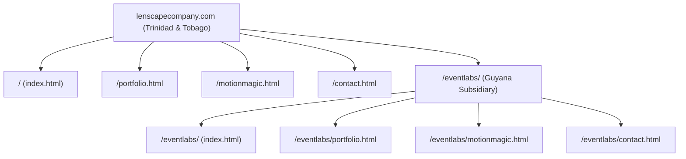

# Information Architecture (IA) & UX Baseline Audit

**Project:** The Lenscape Company Ltd. & Event Labs Guyana  
**Subject URL:** `lenscapecompany.com` / `lenscapecompany.com/eventlabs/`  
**Audit Standard:** Google-Native / Zero-SaaS Cloud Architecture Baseline  
**Document Code:** `AUDIT-IAUX-02`  
**Status:** Complete Baseline Extraction  

---

## 1. Sitemap & Subpath Registry

### 1.1 Complete Route & Subpath Hierarchy

The platform operates across two dual-market regional jurisdictions: **Trinidad & Tobago (Parent Entity)** and **Guyana (Regional Subsidiary)**. The directory layout establishes a clean subpath taxonomy with mirrored entry points.



#### Detailed Route Matrix

| Route URI | Template File | Territory & Context | Primary View / Functionality | Canonical Target |
| :--- | :--- | :--- | :--- | :--- |
| `/` | `index.html` | Trinidad & Tobago (TTD) | Agency flagship landing page: Geometric canvas hero, Bento Grid, curated portfolio preview, client marquee. | `https://lenscapecompany.com/` |
| `/portfolio.html` | `portfolio.html` | Trinidad & Tobago (TTD) | Master catalog of 36 projects with 6 category filter pills, album galleries, video player modal, and client credits. | `https://lenscapecompany.com/portfolio.html` |
| `/motionmagic.html` | `motionmagic.html` | Trinidad & Tobago (TTD) | Experiential 360 & Glambot showcase: 177-frame canvas scrubber, hardware specs, tier comparison matrix. | `https://lenscapecompany.com/motionmagic.html` |
| `/contact.html` | `contact.html` | Trinidad & Tobago (TTD) | Direct agency inquiry page: Contact form, office coordinates, phone hotline, and interactive FAQ. | `https://lenscapecompany.com/contact.html` |
| `/eventlabs/` | `eventlabs/index.html` | Guyana (GYD) | Georgetown regional hub: Electric cyan & lime colorway, GYD pricing defaults, regional client case studies. | `https://lenscapecompany.com/eventlabs/` |
| `/eventlabs/portfolio.html` | `eventlabs/portfolio.html` | Guyana (GYD) | Regional and Caribbean commercial showcase with localized filtering and event highlights. | `https://lenscapecompany.com/eventlabs/portfolio.html` |
| `/eventlabs/motionmagic.html` | `eventlabs/motionmagic.html` | Guyana (GYD) | Guyana MotionMagic Cam booking page for corporate galas, private activations, and brand launches. | `https://lenscapecompany.com/eventlabs/motionmagic.html` |
| `/eventlabs/contact.html` | `eventlabs/contact.html` | Guyana (GYD) | Georgetown direct operations contact, WhatsApp hotline, and corporate RFP desk. | `https://lenscapecompany.com/eventlabs/contact.html` |

### 1.2 In-Page Anchors, Hidden Modals & Drawer Overlays

| Element Selector / ID | Host Template | Trigger Mechanism | Functional Description | UX Role |
| :--- | :--- | :--- | :--- | :--- |
| `#services` | `index.html` | Nav click / `#services` link | Smooth scrolls to Bento Grid showcase (Cards 1–5). | Navigation |
| `#portfolio-showcase` | `index.html` | Flow B trigger / Card 3 click | Smooth scrolls to curated work section with pre-filtered category. | Interactive Flow |
| `#high-value-overlay` | `index.html`, `eventlabs/index.html` | Bento Cards 1 & 2 (`Flow A`) | Full-viewport modal with commercial showreel switcher and inline datepicker. | Conversion Modal |
| `#slide-out-drawer` | `index.html`, `eventlabs/index.html` | Bento Cards 4 & 5 (`Flow C`) | 640px right slide-out panel with digital performance framework and interactive scoping builder. | Solution Drawer |
| `#booking-modal-backdrop` | All 8 pages | `.book-now-btn` click | Global 2-step booking modal wizard with pricing calculator and calendar availability sync. | Transactional Modal |
| `.mobile-nav-drawer` | All 8 pages | `.mobile-nav-toggle` click | Cyberpunk full-screen mobile menu with regional portal switcher (`[SYS.NAV // PORTAL 01]`). | Mobile Navigation |

---

## 2. Interactive Component Registry

### 2.1 The Bento Grid Component (`bento-grid.js`)

The homepage features a 4-column responsive Bento Grid executing 5 distinct micro-interactions and directing users into 3 high-converting engagement flows.

```
+-----------------------------------------------------------------------------------------+
| BENTO GRID INTERACTION ARCHITECTURE                                                     |
+------------------------------------+-------------------+--------------------------------+
| Card Selector & Title              | Micro-Interaction | Target Conversion Flow         |
+------------------------------------+-------------------+--------------------------------+
| 1. .bento-card-1                   | Cinema Lens Pull  | Flow A: High-Value Showreel    |
|    "SYS.01 // CONTENT PRODUCTION"  | scale(1.05) +     | Overlay + Native Booking       |
|    (2x2 Large Card)                | blur focus pull   | Appointment Calendar           |
+------------------------------------+-------------------+--------------------------------+
| 2. .bento-card-2                   | Camera Strobe     | Flow A: Experiential Booth     |
|    "SYS.02 // BOOTH SUITE"         | 150ms opacity     | Showcase + Instant Datepicker  |
|    (1x2 Tall Card)                 | flicker overlay   |                                |
+------------------------------------+-------------------+--------------------------------+
| 3. .bento-card-3                   | SVG Signature     | Flow B: Explorer Scroll        |
|    "SYS.03 // STRATEGIC BRANDING"  | stroke-dashoffset | Smooth scroll to #portfolio    |
|    (1x2 Tall Card)                 | line draw (600ms) | with filter set to 'branding'  |
+------------------------------------+-------------------+--------------------------------+
| 4. .bento-card-4                   | 3D Parallax Tilt  | Flow C: Solution Drawer        |
|    "SYS.04 // DIGITAL SOLUTIONS"   | Mousemove tilt +  | Slide-out drawer with digital  |
|    (2x1 Wide Card)                 | dynamic chart     | framework & project scoper     |
+------------------------------------+-------------------+--------------------------------+
| 5. .bento-card-5                   | Cascading Puzzle  | Flow C: Solution Drawer        |
|    "SYS.05 // GAMIFIED ENGAGEMENT" | Tile Physics      | Directs to game development &  |
|    (2x1 Wide Card)                 | interactive tiles | interactive brief builder      |
+------------------------------------+-------------------+--------------------------------+
```

### 2.2 Deep-Dive: Conversion Flows (A, B, C)

#### Flow A: High-Value Client Showreel Modal (`#high-value-overlay`)
- **Trigger:** Tapping Card 1 or Card 2 in the Bento Grid.
- **Components:**
  - **Showreel Media Switcher:** Instant video player switching between `tailgate-mardi-gras` and `glambot-showcase-1`.
  - **Inline Calendar Picker:** Custom month/day date selection checking real-time availability.
  - **Quick Booking Form (`flowa-booking-form`):** Quick reservation inputs (`#flowa-name`, `#flowa-event`, `#flowa-location`, `#flowa-start-time`, `#flowa-end-time`).
  - **Submission Engine:** Dispatches asynchronously to Google Apps Script backend (`submitBooking(payload)`).

#### Flow B: Explorer Anchor-Scroll (`portfolio-showcase-filters`)
- **Trigger:** Tapping Card 3 (Strategic Branding).
- **Execution:** Triggers GSAP smooth scroll to `#portfolio-showcase`, automatically activates the `[BRANDING & PRINT]` filter pill, and hides unrelated projects with CSS fade-in animations.

#### Flow C: Digital Partner Slide-Out Solution Drawer (`#slide-out-drawer`)
- **Trigger:** Tapping Card 4 or Card 5.
- **Components:**
  - **Performance Framework Visualizer:** Infographics illustrating "Data over Opinions", technical architecture, and agile sprint delivery.
  - **Capabilities Matrix:** Checkbox selector for Web Development, Paid Media, Analytics Dashboard, Interactive Games, and AI Integration.
  - **Interactive Project Scoper Form (`#project-scoper-form`):** Name, email, budget selector, and submit trigger.
  - **Current Defect:** The form has no network handler—executes a simulated `setTimeout` and displays a mock brief ID `DIG-XXXXXX` without saving data.

### 2.3 Interactive Booking Modal Wizard (`booking.js` & `booking-logic.js`)
- **Accessibility:** Accessible via `.book-now-btn` across all headers and footers on all 8 pages.
- **Step 1 (Event Details):**
  - Custom UI calendar datepicker with month/year navigation and booked-date disabling.
  - Service tier radio selector: `Roamer`, `Print Booth`, `360 Booth`, `Glambot MMC`, `Custom Activation`.
  - Time inputs enforcing a mandatory **2-hour minimum duration**:
    ```javascript
    export function validateDuration(startTime, endTime) {
      // Calculates total duration in hours; flags error if duration < 2.0
    }
    ```
  - Custom Arm Choreography toggle (`#field-custom-arm`) flagged as **"Premium/Creative Review"**.
- **Step 2 (Client Specifications & Live Calculation):**
  - Multi-currency rate card support: Trinidad (`TTD`), Guyana (`GYD`), International (`USD`).
  - Dynamic transport add-on calculation: TTD $250, GYD $10,000, USD $50.
  - Add-on checkboxes: Props, Custom Backdrops, Transport.

---

## 3. Content & Copy Deck

### 3.1 Primary Brand Voice & Core Value Propositions

- **Parent Brand:** The Lenscape Company Ltd.
- **Regional Brand:** Event Labs Guyana (A Lenscape Company)
- **Tagline / Headline:** *"Where High-Impact Visuals Meet Flawless Digital Execution."*
- **Positioning Statement:** *"We are a creative experiential agency bridging the gap between high-end commercial visual production, robotic motion camera activations, and full-stack digital engineering across Trinidad, Guyana, and the Caribbean."*
- **Three Core Pillars:**
  1. **Storytelling:** Commercial video, cinematic brand documentaries, and high-impact social advertising campaigns.
  2. **Experience:** High-throughput experiential event activations featuring the robotic MotionMagic Glambot and 360 booths.
  3. **Innovation:** Custom web applications, interactive gamified brand experiences, and server-side data analytics.

### 3.2 System Identifiers & Section Headings

| System Tag | Section / Feature Name | Display Copy / Headline | Accompanying Subtext |
| :--- | :--- | :--- | :--- |
| `[SYS.01]` | Content Production | *"Cinematic Visuals Engineered for Conversion"* | 4K commercial production, dynamic social reels, and high-conversion ad creative. |
| `[SYS.02]` | Experiential Suite | *"The MotionMagic Cam & 360 Suite"* | Robotic camera arm choreography, instant social sharing, and brand fan engagement. |
| `[SYS.03]` | Strategic Branding | *"Identity, Packaging & Outdoor Media"* | Comprehensive visual identities, print design, and large-format outdoor billboards. |
| `[SYS.04]` | Digital Solutions | *"Modern Web Platforms & Performance Engineering"* | Blazing-fast static and dynamic web apps with zero-latency cloud infrastructure. |
| `[SYS.05]` | Gamified Engagement | *"Interactive Brand Games & Digital Contests"* | Custom touch-screen booth games, viral social contests, and fan loyalty platforms. |

### 3.3 Client Roster & Social Proof Points

The codebase showcases authenticated enterprise and regional brand collaborations across commercial production, event media, and digital campaigns:

1. **Global Fast Food Brands:** Burger King (Mother's Day campaign, Steakhouse Whopper, Maraval OOH), Popeyes Caribbean.
2. **Financial & Tech Giants:** VISA International, Republic Bank Ltd. (RBL CPL T20 cricket broadcast), Digicel (Back to School commercial).
3. **Energy & Enterprise:** Shell Trinidad & Tobago (Black & White Gala), bmobile / TSTT (Emerald City commercial), ICATT (Annual International Finance Conference).
4. **Consumer & Beverage Brands:** The Coca-Cola Company (ICC Men's T20 World Cup fan zones), Caribbean Bottlers Ltd., RudeBoy Caribbean.
5. **Hospitality & Education:** Hilton Hotels & Resorts, The University of the West Indies (UWI).

---

## 4. Remediation Action Matrix (IA & UX Components)

| Component | Current State | Target Remediation | Action Flag |
| :--- | :--- | :--- | :---: |
| **Bento Grid Aesthetic** | Cyberpunk dark aesthetic (`SYSTEM_INIT`) | Retain visual branding and micro-interactions | `[KEEP]` |
| **Flow A Showreel Overlay** | Working video switcher + booking form | Integrate with Firestore booking queue and Cloud Storage HLS video | `[OPTIMIZE]` |
| **Flow B Filter Scroll** | Smooth scroll + Isotope category filter | Retain existing GSAP filter and deep-link query parameters | `[KEEP]` |
| **Flow C Solution Drawer** | Static scoper with mock 1s timer | Replace mock submit with dynamic Firebase-backed proposal calculator | `[REPLACE]` |
| **Booking Modal Wizard** | Client-side calculations + Apps Script | Route via Google Cloud Function to Firestore + automated PDF generation | `[REPLACE]` |
| **Mobile Navigation** | Full-screen cyber navigation drawer | Retain styling, improve contrast and accessibility focus trap | `[KEEP]` |
| **Regional Routing** | `/eventlabs/` mirrored static files | Maintain subpath structure; implement Cloud Run edge routing | `[KEEP]` |
