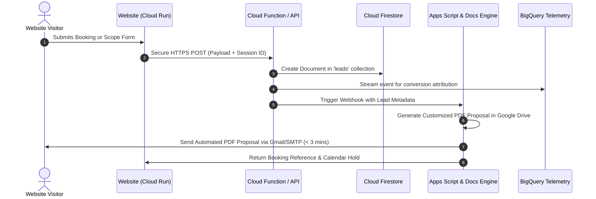

# Data Flow, Telemetry & SEO Baseline Audit

**Project:** The Lenscape Company Ltd. & Event Labs Guyana  
**Subject URL:** `lenscapecompany.com` / `lenscapecompany.com/eventlabs/`  
**Audit Standard:** Google-Native / Zero-SaaS Cloud Architecture Baseline  
**Document Code:** `AUDIT-DATA-03`  
**Status:** Complete Baseline Extraction  

---

## 1. Form & Endpoint Inventory

### 1.1 Complete Form Field Schema & Input Parameters

The site utilizes 4 separate user-facing forms across its Trinidad and Guyana deployments. Each form was audited for field-level attributes, validation rules, payload formatting, and backend persistence.

#### Form 1: Global Booking Modal Wizard (`booking-form`)
- **Host Component:** `booking.js` / `booking-logic.js` (Rendered on all 8 pages).
- **Target Table / Entity:** `Bookings` sheet & Google Calendar.
- **Current Endpoint:** `https://script.google.com/macros/s/AKfycbyVYgpu19c2b9-R3G3mcEzoC3JMKyyAEghVLb6qSX9jMX1T2kI8mFbHeEbAeo9TPEF1/exec` (Dual-sync Apps Script Web App).

| Field ID / Parameter | Input Type | Required | Default / Accepted Values | Validation Logic |
| :--- | :--- | :---: | :--- | :--- |
| `field-client-name` (`clientName`) | `text` | Yes | String | Non-empty string. |
| `field-client-email` (`clientEmail`) | `email` | Yes | String | Standard RFC email regex. |
| `field-client-phone` (`clientPhone`) | `tel` | Yes | String | Minimum 7 digits. |
| `field-event-name` (`eventName`) | `text` | Yes | String | Non-empty string. |
| `field-location` (`location`) | `select` | Yes | TT: Port of Spain, San Fernando, Tobago, etc.<br>GY: Georgetown, Demerara, Berbice, etc. | Must match predefined territory. |
| `field-start-time` (`startTime`) | `time` | Yes | `HH:MM` (24hr or 12hr AM/PM) | Must precede end time. |
| `field-end-time` (`endTime`) | `time` | Yes | `HH:MM` (24hr or 12hr AM/PM) | **Enforces >= 2.0 hrs duration.** |
| `field-music` (`music`) | `select` | No | Commercial, Soca, Afrobeats, Pop, Hip-Hop, Custom | Optional customization. |
| `addon-props` (`addons`) | `checkbox` | No | Boolean flag / "Props" | Optional add-on. |
| `addon-backdrops` (`addons`) | `checkbox` | No | Boolean flag / "Custom Backdrops" | Optional add-on. |
| `addon-transport` (`addons`) | `checkbox` | No | Boolean flag / "Transport" | Dynamic surcharge added to rate. |
| `tier` (`tier`) | `radio` | Yes | `roamer`, `print`, `360`, `glambot`, `custom` | Sets base hourly pricing. |
| `field-custom-arm` (`customArmPaths`)| `checkbox` | No | Boolean flag | **Triggers "Pending — Premium Review".** |
| `field-notes` (`notes`) | `textarea` | No | Text string | Freeform production notes. |

#### Form 2: Quick Booking Form (`flowa-booking-form-wrap`)
- **Host Component:** Bento Grid Flow A Showreel Modal (`index.html`, `eventlabs/index.html`).
- **Endpoint:** Dispatches directly through `booking-logic.js` -> `submitBooking(payload)`.

| Field ID | Input Type | Required | Payload Parameter | Notes |
| :--- | :--- | :---: | :--- | :--- |
| `#flowa-name` | `text` | Yes | `clientName` | Quick-reservation client name. |
| `#flowa-event` | `text` | Yes | `eventName` | Event title or brand name. |
| `#flowa-location` | `select` | Yes | `location` | Geographic district. |
| `#flowa-start-time` | `time` | Yes | `startTime` | Booking start time. |
| `#flowa-end-time` | `time` | Yes | `endTime` | Booking end time (validates >= 2.0 hrs). |

#### Form 3: Digital Partner Solution Scoper (`project-scoper-form`)
- **Host Component:** Slide-Out Solution Drawer Flow C (`bento-grid.js`).
- **Current Endpoint:** **DISCONNECTED / NO BACKEND**. Employs a simulated `setTimeout` of 1,000ms and generates a mock brief reference ID: `DIG-${Date.now().toString().slice(-6)}`.

| Field Selector | Input Type | Required | Value / Parameter | Defect Severity |
| :--- | :--- | :---: | :--- | :--- |
| `input[type="checkbox"]` (5) | `checkbox` | No | Capabilities: Web Dev, Paid Media, Analytics, Games, AI | High (Data dropped). |
| `#scoper-name` | `text` | Yes | Client Name | High (Lead lost). |
| `#scoper-email` | `email` | Yes | Client Email | High (Lead lost). |
| `#scoper-budget` | `hidden` | No | TTD: $5K-$15K, $15K-$35K, $35K+<br>GYD: $150K-$450K, $450K-$1M, $1M+ | High (Lead lost). |

#### Form 4: Direct Contact & Inquiry Form (`contact-form`)
- **Host Component:** `contact.html` & `eventlabs/contact.html` (Controlled by `contact.js`).
- **Current Endpoint:** Hardcoded to `https://script.google.com/macros/s/YOUR_DEPLOYMENT_ID/exec`.
- **Runtime Mode:** **STUB_MODE active**. Bypasses network request, logs payload to browser console, and displays simulated green alert message.

| Field ID | Name Parameter | Input Type | Required | Description |
| :--- | :--- | :--- | :---: | :--- |
| `#cf-name` | `name` | `text` | Yes | Client contact full name. |
| `#cf-email` | `email` | `email` | Yes | Corporate email address. |
| `#cf-phone` | `phone` | `tel` | No | Phone contact. |
| `#cf-subject` | `subject` | `select` | Yes | Production category inquiry. |
| `#cf-budget` | `budget` | `select` | No | Estimated production budget. |
| `#cf-message` | `message` | `textarea` | Yes | Project requirements & scope. |

### 1.2 Target Cloud Data Architecture



---

## 2. Analytics & Tag Audit

### 2.1 Current Telemetry Status: Attribution Black Hole

A code search across all 8 HTML files and accompanying JavaScript modules confirmed that **zero analytics tags, tag management containers, or telemetry pixels are currently installed**.

```
+-----------------------------------------------------------------------------------------+
| TELEMETRY AUDIT: ZERO TRACKING SCRIPTS INSTALLED                                        |
+------------------------------------+----------------+-----------------+-----------------+
| Tracking System                    | Expected ID    | Current Status  | Risk Level      |
+------------------------------------+----------------+-----------------+-----------------+
| Google Tag Manager (GTM)           | GTM-XXXXXXX    | MISSING (0/8)   | CRITICAL        |
| Google Analytics 4 (GA4)           | G-XXXXXXXXXX   | MISSING (0/8)   | CRITICAL        |
| Meta Pixel (Facebook Ads)          | 15-digit ID    | MISSING (0/8)   | HIGH            |
| Microsoft Clarity                  | 10-char ID     | MISSING (0/8)   | HIGH            |
| Google Ads Conversion Tag          | AW-XXXXXXXXX   | MISSING (0/8)   | HIGH            |
+------------------------------------+----------------+-----------------+-----------------+
```

### 2.2 Business Risks & Technical Gaps
1. **Ad-Blocker Vulnerability:** When tags are implemented purely via traditional client-side JavaScript (`gtag.js` or client-side GTM), Caribbean and global tech users running ad-blockers (Brave, uBlock Origin, AdGuard) result in a **25% to 40% loss in recorded conversions and visitor analytics**.
2. **Attribution Blindness:** With no conversion tracking on the booking form or scoper, paid campaigns on Google Ads or Meta Ads cannot evaluate Cost Per Lead (CPL) or Return on Ad Spend (ROAS).
3. **Absence of User Session Replay:** The complex micro-interactions in the Bento Grid (Card tilt, video pull, 177-frame glambot sequence) cannot be monitored for drop-offs or user friction without behavioral heatmapping (Microsoft Clarity).

### 2.3 Target Server-Side Telemetry Blueprint (`[REPLACE]`)

Deploy **Server-Side Google Tag Manager (sGTM)** on Google Cloud Run alongside the agency website:
- **First-Party Data Stream:** Client sends events to `collect.lenscapecompany.com` bypassing ad-blockers.
- **Server Container:** Validates and enriches payloads, streaming clean records directly to:
  1. **Google Analytics 4 (GA4)** for engagement reporting.
  2. **BigQuery** (`lenscape_analytics.events_*`) for raw event retention and custom AI analysis.
  3. **Meta Conversions API (CAPI)** via server-to-server dispatch for 100% ad conversion match rates.
  4. **Microsoft Clarity** for session recordings and visual click heatmaps.

---

## 3. SEO & Metadata Map

### 3.1 Page-by-Page Audit Matrix

| Page Path | Title Tag Status | Meta Description Status | Canonical Tag | OpenGraph (og:) | Twitter Cards | Schema.org |
| :--- | :--- | :--- | :---: | :---: | :---: | :---: |
| `/index.html` | The Lenscape Company Ltd \| Creative Agency — Trinidad & Tobago | Full description present (167 chars) | **MISSING** | **MISSING** | **MISSING** | **MISSING** |
| `/portfolio.html` | Portfolio \| The Lenscape Company Ltd | Full description present (146 chars) | **MISSING** | **MISSING** | **MISSING** | **MISSING** |
| `/motionmagic.html` | MotionMagic Cam \| The Lenscape Company Ltd | Truncated description present | **MISSING** | **MISSING** | **MISSING** | **MISSING** |
| `/contact.html` | Contact \| The Lenscape Company Ltd | Full description present (153 chars) | **MISSING** | **MISSING** | **MISSING** | **MISSING** |
| `/eventlabs/index.html` | Event Labs Guyana \| Creative Experiential Agency... | Full description present (129 chars) | **MISSING** | **MISSING** | **MISSING** | **MISSING** |
| `/eventlabs/portfolio.html` | Portfolio \| Event Labs Guyana | Full description present (225 chars) | **MISSING** | **MISSING** | **MISSING** | **MISSING** |
| `/eventlabs/motionmagic.html`| MotionMagic Cam \| Event Labs Guyana | Truncated description present | **MISSING** | **MISSING** | **MISSING** | **MISSING** |
| `/eventlabs/contact.html` | Contact \| Event Labs Guyana (A Lenscape Company) | Full description present (191 chars) | **MISSING** | **MISSING** | **MISSING** | **MISSING** |

### 3.2 Regional SEO & Hreflang Implementation Requirements

Because the agency operates across both Trinidad & Tobago and Guyana with shared services (MotionMagic Cam, commercial video production), the HTML heads must specify reciprocal language and regional alternate links to prevent duplicate content penalties:

```html
<!-- Trinidad & Tobago Canonical & Alternate -->
<link rel="canonical" href="https://lenscapecompany.com/" />
<link rel="alternate" hreflang="en-TT" href="https://lenscapecompany.com/" />
<link rel="alternate" hreflang="en-GY" href="https://lenscapecompany.com/eventlabs/" />
<link rel="alternate" hreflang="x-default" href="https://lenscapecompany.com/" />
```

### 3.3 Structured Data (JSON-LD) Roadmap

Each regional jurisdiction requires distinct Schema.org markup injected into the `<head>` of each template:

#### Trinidad & Tobago Schema (`index.html`)
```json
{
  "@context": "https://schema.org",
  "@type": "ProfessionalService",
  "name": "The Lenscape Company Ltd.",
  "image": "https://lenscapecompany.com/Company%20Logo/lenscape-logo.png",
  "url": "https://lenscapecompany.com",
  "telephone": "+1-868-777-5367",
  "priceRange": "$$$",
  "address": {
    "@type": "PostalAddress",
    "addressLocality": "Port of Spain",
    "addressCountry": "TT"
  },
  "geo": {
    "@type": "GeoCoordinates",
    "latitude": 10.6596,
    "longitude": -61.5042
  },
  "currenciesAccepted": "TTD, USD"
}
```

#### Guyana Regional Schema (`eventlabs/index.html`)
```json
{
  "@context": "https://schema.org",
  "@type": "ProfessionalService",
  "name": "Event Labs Guyana (A Lenscape Company)",
  "image": "https://lenscapecompany.com/Company%20Logo/Lenscape%20Guyana/Event%20Lab%20Logo%201%20Cropped.png",
  "url": "https://lenscapecompany.com/eventlabs/",
  "telephone": "+592-600-LENS",
  "priceRange": "$$$",
  "address": {
    "@type": "PostalAddress",
    "addressLocality": "Georgetown",
    "addressRegion": "Demerara-Mahaica",
    "addressCountry": "GY"
  },
  "currenciesAccepted": "GYD, USD"
}
```

---

## 4. Remediation Action Matrix (Data Flow, Telemetry & SEO)

| Component | Current State | Target Remediation | Action Flag |
| :--- | :--- | :--- | :---: |
| **Project Scoper Form** | Simulated `setTimeout` submission | Connect to Cloud Function / Firestore proposal engine | `[REPLACE]` |
| **Contact Form** | Placeholder `YOUR_DEPLOYMENT_ID` stub | Connect to unified Cloud Function / Firestore pipeline | `[REPLACE]` |
| **Booking Modal Engine** | Client-side Apps Script POST | Enhance with Firestore persistence + automatic proposal PDF generation | `[OPTIMIZE]` |
| **Client-Side Telemetry** | 0 tracking scripts installed | Deploy Server-Side GTM on Cloud Run with GA4 & BigQuery streams | `[REPLACE]` |
| **Canonical URLs** | Missing across all 8 pages | Add explicit self-referential canonical tags to all HTML templates | `[OPTIMIZE]` |
| **Social OpenGraph & Twitter**| Missing across all 8 pages | Add rich `og:image`, `og:title`, and `twitter:card` tags | `[OPTIMIZE]` |
| **Schema.org Structured Data**| Missing across all 8 pages | Inject JSON-LD `ProfessionalService` schemas for TT and Guyana | `[OPTIMIZE]` |
